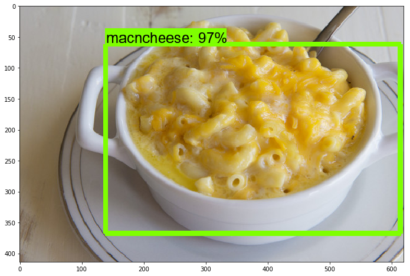
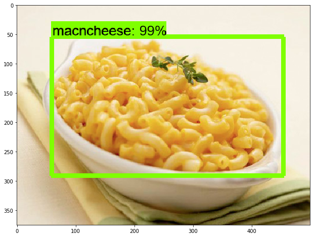

## Tensorflow Object Detection Using ML
Object_detection_tutorial.ipynb and object_detection_tutorial_1.ipynb.contains image classification. object_detection_live.ipynb contains video classification of 30 different objects.

:point_down: Screenshot:

  

  

